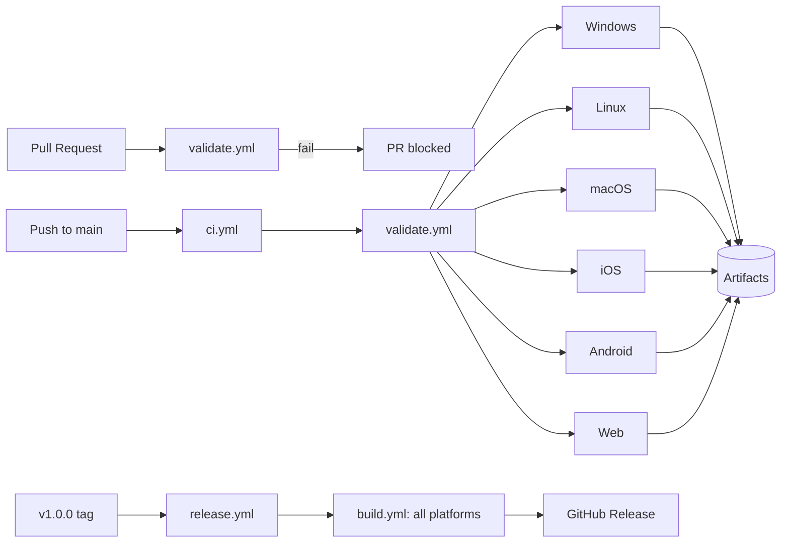

# KOS Restaurant ERP & POS System

A complete enterprise-grade Restaurant ERP & POS Management System built with Flutter and SQLite.

## Features

- **POS Billing System**: High-speed billing interface with cart management.
- **Localhost Web Ordering**: Built-in Shelf server to serve local API for customer ordering.
- **Table Management**: Live table status tracking.
- **Kitchen KOT**: Real-time order updates for the kitchen.
- **Inventory Tracking**: Stock management and alerts.
- **Analytics Dashboard**: Real-time sales and metrics.

## Tech Stack

- **Frontend**: Flutter (Latest)
- **Database**: SQLite (via `sqflite`)
- **State Management**: BLoC (Setup ready)
- **Local Server**: Shelf (for Localhost Web Ordering)

## Project Structure

```text
lib/
├── core/
│   ├── database/       # Database helper and schema
│   └── ...
├── models/             # Data models
├── repositories/       # Data repositories
├── screens/            # UI Screens (Login, Dashboard, POS, etc.)
├── services/           # Background services (Local Server)
└── main.dart           # App entry point and routing
```

## How to Run

1.  **Get Dependencies**:
    ```bash
    flutter pub get
    ```

2.  **Run the App**:
    ```bash
    flutter run
    ```

    *Note: The app starts a local server on port 8080 for LAN access.*

## Default Credentials

- **Username**: `owner`
- **Password**: `owner123`

---

## Supported Platforms

Dine Master is a cross-platform Flutter application. The same core business logic,
SQLite database behavior, and **navy & gold** branding are shared across all targets:

| Platform        | Status            | CI Runner          |
|-----------------|-------------------|--------------------|
| Windows         | ✅ Supported      | `windows-latest`   |
| Linux           | ⚠️ Best-effort    | `ubuntu-latest`    |
| macOS           | ✅ Supported      | `macos-latest`     |
| iOS / iPhone    | ✅ Supported      | `macos-latest`     |
| Android / Mobile| ✅ Supported      | `ubuntu-latest`    |
| Web             | ✅ Supported      | `ubuntu-latest`    |

All screens are fully responsive for desktop, tablet, and mobile, and support both
mouse/keyboard and touch interactions.

---

## Local Development Setup

### Prerequisites

- [Flutter SDK](https://docs.flutter.dev/get-started/install) (stable channel, `^3.11.1`)
- For Windows builds: Visual Studio with the C++ desktop workload
- For Android builds: Android SDK
- For iOS/macOS builds: macOS + Xcode
- For Linux builds: GTK 3 development headers (`libgtk-3-dev`, `ninja-build`)

### Install dependencies

```bash
flutter pub get
```

### Run the app (with a connected device / emulator)

```bash
flutter run
```

> The app starts a local Shelf server on port `8080` for LAN/web ordering and
> uses `sqflite` (or `sqflite_common_ffi` on desktop) for the local database.

---

## Build Commands

| Platform | Command |
|----------|---------|
| Windows  | `flutter build windows --release` |
| Linux    | `flutter build linux --release` |
| macOS    | `flutter build macos --release` |
| iOS      | `flutter build ios --release` |
| Android  | `flutter build apk --release` |
| Web      | `flutter build web --release` |

To pin a version for a build, pass `--build-name` and `--build-number`:

```bash
flutter build apk --release --build-name 1.0.0 --build-number 1
```

---

## Testing Commands

```bash
# Static analysis (fails on errors and warnings; info lints are non-fatal)
dart analyze --no-fatal-infos

# Run all unit and widget tests
flutter test

# Run a single test file
flutter test test/order_model_test.dart
```

---

## GitHub Actions CI/CD

The repository ships three workflows under `.github/workflows/`:

- **`pull_request.yml`** — Runs on every PR to `main`. Installs dependencies,
  runs static analysis, and runs all tests. Fails the PR if any step fails.
- **`ci.yml`** — Runs on every push to `main`. Runs the full quality gate, then
  builds production packages and uploads them as GitHub Actions **artifacts**
  for Windows, Linux, macOS, iOS, Android, and Web.
- **`release.yml`** — Runs when a `v*` tag is pushed (e.g. `v1.0.0`). Runs the
  complete test + build pipeline for all platforms, creates a **GitHub Release**,
  and attaches the platform-specific build artifacts. The Linux desktop build is
  best-effort and does **not** block the release.

The reusable `validate.yml` and `build.yml` keep the workflows DRY and consistent.
Actions versions are pinned to major versions (`v2`, `v4`) and Flutter/Dart caching
is enabled for faster runs.

### Workflow overview



---

## Required GitHub Secrets

Configure these in **Settings → Secrets and variables → Actions**. Never commit
secrets, keystores, or Apple certificates to the repository. Store the values as
**Base64-encoded** strings (e.g. `base64 -i file | pbcopy`).

> The signing secrets are all **optional**. If a platform's secrets are not set,
> the CI still builds that platform, and the resulting package is either unsigned
> or (for Android) signed with the debug keystore.

| Secret | Required for | Description |
|--------|--------------|-------------|
| `ANDROID_CREDENTIALS` | Android signing/Publish | Base64 of Google Play service account JSON |
| `ANDROID_KEY_PROPERTIES` | Android release signing | Base64 of `key.properties` (storePassword, keyAlias, keyPassword) |
| `ANDROID_KEYSTORE` | Android release signing | Base64 of the upload keystore (`.jks`) |
| `MACOS_CERTIFICATE` | macOS codesigning | Base64 of the Apple certificate (`.p12`) |
| `MACOS_CERTIFICATE_PWD` | macOS codesigning | Password for the macOS `.p12` |
| `MACOS_CERTIFICATE_NAME` | macOS codesigning | Certificate identity (name) for codesign |
| `APPLE_CERTIFICATE_P12` | iOS codesigning | Base64 of the Apple Distribution certificate (`.p12`) |
| `APPLE_CERTIFICATE_PASSWORD` | iOS codesigning | Password for the iOS `.p12` |
| `APPLE_CERTIFICATE_FILENAME` | iOS codesigning | Filename for the `.p12` (e.g. `dist.p12`) |
| `APPLE_PROVISIONING_PROFILE` | iOS codesigning | Base64 of the `.mobileprovision` profile |
| `APPLE_PROVISIONING_FILENAME` | iOS codesigning | Filename for the profile |
| `APP_STORE_CONNECT_ISSUER_ID` | iOS TestFlight | App Store Connect API Issuer ID |
| `APP_STORE_CONNECT_KEY_ID` | iOS TestFlight | App Store Connect API Key ID |
| `APP_STORE_CONNECT_KEY` | iOS TestFlight | App Store Connect API private key (`.p8`) contents |

### Generating the Android signing secrets

1. Create an upload keystore:
   ```bash
   keytool -genkey -v -keystore upload-keystore.jks -alias upload -keyalg RSA -keysize 2048 -validity 10000
   ```
2. Create a `key.properties` in `android/` (git-ignored):
   ```properties
   storePassword=<your-store-password>
   keyPassword=<your-key-password>
   keyAlias=upload
   storeFile=/absolute/path/to/upload-keystore.jks
   ```
3. Encode each file to Base64 and store them in `ANDROID_KEY_PROPERTIES` and
   `ANDROID_KEYSTORE` plus the Play service account JSON in `ANDROID_CREDENTIALS`.

> The build script rewrites the `storeFile` path at CI time, so the local absolute
> path in `key.properties` does not need to match the runner.

---

## Versioning & Releases

Dine Master follows **`Major.Minor.Patch`** versioning (e.g. `1.0.0`). The
application version lives in `pubspec.yaml` (`version: 1.0.0+1`). Release tags use
the `v` prefix: `v1.0.0`, `v1.1.0`, etc.

### Release/tagging process

1. Bump `version:` in `pubspec.yaml` and commit.
2. Push the version tag:
   ```bash
   git tag v1.0.0
   git push origin v1.0.0
   ```
3. The `release.yml` workflow runs automatically:
   - Runs `dart analyze` + `flutter test`.
   - Builds production packages for Android, Web, Windows, macOS, and iOS.
   - Creates a **GitHub Release** named `Dine Master v1.0.0`.
   - Attaches the platform build artifacts to the release.
   - Uploads the iOS build to **App Store Connect / TestFlight** when iOS signing
     and App Store Connect secrets are configured (`upload-ios: true`).
4. Optionally edit the release notes on GitHub after creation.

> The tag name minus the `v` prefix is used as the app `--build-name`, keeping the
> published package version synchronized with the release.

---

## Downloading Generated Builds

- **From Actions (push to main):** open the **Actions** tab → select the latest
  **CI - Push to Main** run → scroll to **Artifacts** → download the platform archive.
- **From a GitHub Release:** open the **Releases** page → select the version → the
  platform build files are listed under **Assets**.

Artifacts are retained for 14 days from the CI run.

---

## Notes on Production Distribution

- The current iOS and Android bundle identifiers are placeholders
  (`com.nexodine`) and macOS uses `com.example.kos`. Update these in
  `ios/Runner.xcodeproj`, `android/app/build.gradle.kts`, and
  `macos/Runner/Configs/AppInfo.xcconfig` **before** distributing via public app
  stores or enabling automatic signing.
- Android release builds sign with the **debug keystore by default**. Configure
  the Android signing secrets (described above) before shipping to Google Play.
- App Store / TestFlight distribution requires a paid Apple Developer account, a
  distribution certificate, and a provisioning profile for a real bundle ID.

