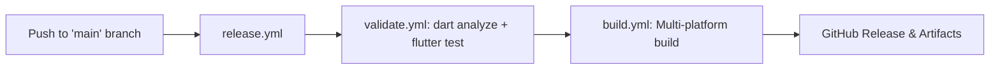

# KOS Restaurant ERP & POS System

A complete enterprise-grade Restaurant ERP & POS Management System built with Flutter and SQLite.

## Features

> 📖 **Full Feature Breakdown**: For an exhaustive, granular specification of all modules, workflows, and subfeatures, see [features.md](features.md).  
> 🚀 **Quick Execution Guide**: For step-by-step terminal commands, paths, and backend/frontend launch options, see [run.md](run.md).

### 🍽️ Point of Sale (POS) & High-Speed Billing
- **Fast Billing Interface**: Optimized for touchscreens, keyboard shortcuts, and mouse operation.
- **Multiple Order Types**: Full support for Dine-In, Table Orders, Takeaway, Delivery, Online Orders, and Walk-in customers.
- **Cart & Discount Management**: Itemized quantity adjustments, custom order notes, and flexible discounts (Flat amount or Percentage).
- **Tax & GST Calculation**: Automatic multi-slab GST tax computation with configurable rates.
- **Flexible Payment Methods**: Record transactions via Cash, Card, UPI, and Digital Wallets with instant payment status updates.
- **Order Park & Reopen**: Hold active orders and instantly reopen them from the POS or table view for settlement.
- **Thermal Invoice & Receipt Printing**: Integrated thermal printer support (IP & port configuration) with PDF preview and receipt generation.

### 🪑 Interactive Table Management & Reservations
- **Visual Table Layout Grid**: Real-time floor plan with color-coded table statuses (Available, Occupied, Reserved, Ordering, Preparing, Bill Requested, Payment Pending, Paid, Cleaning, Out of Service).
- **24-Hour Booking Time Grid**: Interactive timeline view to schedule, inspect, and manage table reservations across 1-hour time slots.
- **Reservation & Booking Manager**: Dedicated tracking for upcoming reservations, guest headcounts, customer contact details, and check-in workflows.
- **Active Hold Orders Tab**: Centralized view of all parked and active table tabs for quick access.
- **Section & Layout Customization**: Organize dining spaces by sections and rooms (e.g., Main Hall, AC Room, Terrace, Bar, Private Dining).
- **Table Configuration**: Customize table numbers, seating capacity, table types (Standard, Booth, Bar Counter), and reservability.
- **Staff Assignment**: Direct assignment of designated waiters to tables and orders.

### 👨‍🍳 Kitchen Display System (KDS) & Real-Time KOT
- **Digital Kitchen Order Tickets (KOT)**: Paperless kitchen tickets automatically dispatched upon order placement.
- **Live WebSocket Sync**: Real-time bi-directional synchronization between POS terminals, waiter tablets, and kitchen screens.
- **Lifecycle Status Tracking**: Track dishes seamlessly through `Pending` ➔ `Cooking/Preparing` ➔ `Ready` ➔ `Served`.
- **Kitchen Section Routing**: Filter and organize tickets by prep station (Chinese, Tandoor, Fast Food, Main Course, Bakery/Dessert, Beverages).
- **Smart Ticket Sorting**: Sort tickets by Oldest First, Priority/Urgent, Table Number, or Fastest Preparation time.
- **Automated Delay Alerts**: Target prep time countdowns with automated prompts to capture delay reasons for audit and reporting.
- **Kitchen History Archive**: Historical log of fulfilled KOTs with timestamps and assigned chef metrics.

### 📱 Dedicated Waiter Mobile & Tablet Ordering
- **Handheld Optimized Interface**: Responsive floor plan view crafted for waiter tablets and smartphones.
- **Quick Order Creation**: Tap any table to view occupancy, assign staff, and start taking orders immediately.
- **Digital Menu Browsing**: Instant categorization and search with dietary badges and real-time item availability.
- **Item Customization Dialog**: Add special dietary preferences, custom spice levels (Sweet, Spicy, Extra Spicy, Mild), and special chef instructions per item.
- **Waiter & Chef Assignment**: Designate order takers and prep chefs directly per order ticket.
- **1-Tap KOT Firing**: Instant submission of kitchen tickets from the table-side cart drawer.

### 🌐 Customer Self-Ordering & Local LAN Web Server
- **Zero-Install Web Ordering**: Built-in Shelf HTTP and WebSocket server running locally on port `8080`.
- **QR Code Digital Menu**: Diners scan a table QR code to browse the live menu directly in their mobile browser.
- **Self-Service Cart & Ordering**: Customers place orders over the local restaurant Wi-Fi without needing internet or app store downloads.
- **Local Network Sync**: Real-time cross-device communication across all terminals on the LAN.

### 📋 Menu, Recipe & Dietary Attribute Management
- **Menu Catalog**: Manage items, categories, base pricing, tax slabs, and veg/non-veg status.
- **Dietary & Taste Badging**: Tag items with dietary tags (*Pure Jain*, *Semi Jain*, *Vegan*, *Gluten-Free*) and taste indicators (*Mild*, *Spicy*, *Sweet*).
- **Special Highlights**: Promote items with special badges (*Chef's Special*, *Best Seller*, *New*, *Seasonal*, *Recommended*).
- **Recipe & Ingredient Mapping**: Link menu items to raw inventory ingredients for automatic stock deduction upon order creation.
- **Cooking Instructions & Prep Metadata**: Document preparation time, cooking time, portion sizes, difficulty levels, and step-by-step cooking procedures.
- **Kitchen Video Guides**: Attach and play training videos directly inside the recipe management module.

### 📦 Inventory, Stock & Vendor Management
- **Real-Time Stock Tracking**: Track raw ingredients, packaging, and supplies with automated deduction on order execution.
- **Low Stock & Expiry Alerts**: Configurable low-stock thresholds with proactive visual warnings and out-of-stock guards.
- **Unit of Measurement (UOM)**: Support for grams, kilograms, liters, milliliters, and individual units/pieces.
- **Vendor & Supplier Directory**: Maintain supplier details, contact persons, phone numbers, and procurement histories.

### ⏱️ Live Operations Tracking & Audit Logging
- **Real-Time Order Timeline**: Monitor active order progress from placement to settlement.
- **Comprehensive Audit Trail**: `order_status_logs` logging every state transition, responsible staff member, and timestamp.
- **Operational Metrics**: Real-time calculation of average preparation times, delayed orders, and peak dining hours.
- **Chef Speed & Performance**: Metrics tracking individual chef completion times and output efficiency.

### 📊 Analytics, Financial Reporting & Accounting
- **Executive Dashboard**: Daily sales totals, active table occupancy rates, open orders, and low-stock alerts at a glance.
- **Sales & Revenue Breakdown**: Analyze revenue trends across dates, payment modes (Cash vs. UPI vs. Card), and order types.
- **Product & Category Insights**: Identify top-selling dishes, highest-margin categories, and slow-moving items.
- **Accounting Ledger & P&L**: Track total revenue, operational expenses, net profit, and collected GST taxes with date-range filters.
- **Expense Management**: Categorize operational expenses (supplies, utilities, maintenance, payroll) with receipt logging.

### 🏢 Multi-Branch, User Management & System Administration
- **Multi-Restaurant / Multi-Branch**: Support for configuring and managing multiple restaurant outlets and branches.
- **Role-Based Access Control (RBAC)**: Manage credentials and granular permissions for Admin, Manager, Cashier, Waiter, and Chef roles.
- **Staff Shifts & Contact Profiles**: Track employee contact details, assigned shifts (Morning, Evening, Full Day), and active/inactive status.
- **Database Backup & Restore**: Safe SQLite database backup, export, and migration utilities.
- **Thermal Printer & Hardware Settings**: Network printer configuration (IP, Port, ESC/POS setup) and receipt layout settings.
- **Theme & UI Customization**: Clean Modern Light Theme with gold & navy branding, responsive for desktop, tablet, and mobile.


## Tech Stack

- **Frontend**: Flutter (Latest)
- **Database**: SQLite (via `sqflite`)
- **State Management**: BLoC (Setup ready)
- **Local Server**: Shelf (for Localhost Web Ordering)

## Project Structure

```text
├── frontend/                # Cross-Platform Flutter Client
│   ├── lib/
│   │   ├── core/            # Database helper and schema
│   │   ├── models/          # Data models
│   │   ├── repositories/    # Data repositories
│   │   ├── screens/         # UI Screens (Login, Dashboard, POS, etc.)
│   │   ├── services/        # Background services (Shelf Local Server)
│   │   └── main.dart        # App entry point and GoRouter
│   ├── test/                # 41 Unit and widget tests
│   ├── assets/              # Logos, fonts, demo assets
│   ├── android/, ios/       # Mobile platform runners
│   ├── windows/, macos/     # Desktop platform runners
│   ├── linux/, web/         # Linux and Web targets
│   └── pubspec.yaml         # Dependencies and versioning
├── backend/                 # Spring Boot Backend (Java 21)
│   ├── src/main/java/       # REST controllers, services, JPA repos, entities
│   ├── src/main/resources/  # application.yml and profile configs
│   ├── src/test/            # Automated backend integration tests
│   ├── pom.xml              # Maven dependencies
│   └── mvnw.cmd / mvnw      # Maven wrapper
└── .github/workflows/       # GitHub Actions CI/CD workflows
```

## 🔒 Isolated Project Environment

DineMaster manages all required runtimes and toolchains within its own self-contained project environment (`.venv`), ensuring zero reliance on global system `PATH` variables or conflicting system-wide JDK/Flutter installations:

- **Backend JDK:** Contained OpenJDK 21 LTS (`.venv/jdk`)
- **Frontend Flutter & Dart:** Project-contained Flutter SDK (`.venv/flutter`)
- **Build Tools:** Embedded Maven Wrapper (`backend/mvnw.cmd` / `backend/mvnw`)

### One-Time Environment Setup (or Fresh Machine Clone)
Run the automated provisioning script to set up all dependencies and tools:
```bash
# Windows PowerShell:
.\setup_env.ps1

# Windows Command Prompt (CMD):
setup_env.bat

# Linux / macOS (Bash):
./setup_env.sh
```

### Virtual Environment Activation
Activate the project environment in your terminal session before building or running:
```bash
# Windows PowerShell:
.\Activate.ps1

# Windows Command Prompt (CMD):
activate.bat

# Linux / macOS / Bash:
source ./activate.sh
```
When active, your prompt indicates `(DineMaster-env)`. Run `check-env` (PowerShell/Bash) to verify that `java`, `flutter`, and `dart` resolve strictly from the project `.venv`. Run `deactivate` to exit.

---

## Execution Commands & How to Run

### 1. Prerequisites (Managed via Isolated Environment)
- **Frontend**: Flutter SDK `^3.11.1+` (managed in `.venv/flutter`)
- **Backend**: Java 21 JDK (managed in `.venv/jdk`)
- **Database**: PostgreSQL 16+ (optional, H2 in-memory profile available for zero DB setup)

---

### 2. Frontend (Flutter) Execution Commands

Navigate to the `frontend/` directory before running any frontend commands:
```bash
cd frontend
```

#### A. Environment Setup
```bash
# Windows Command Prompt (CMD):
copy .env.example .env

# Windows PowerShell / Linux / macOS (Bash):
cp .env.example .env
```
Key frontend variables:
- `API_BASE_URL`: `http://localhost:8081/api` (Spring Boot backend)
- `LOCAL_SERVER_PORT`: `8080` (Embedded Shelf server)

#### B. Install Dependencies
```bash
flutter pub get
```

#### C. Run Application in Development Mode
```bash
# Run on Windows Desktop (default)
flutter run -d windows

# Run on Web (Chrome)
flutter run -d chrome

# Run on macOS Desktop
flutter run -d macos

# Run on Linux Desktop
flutter run -d linux

# Run on connected Android device/emulator
flutter run -d android
```
> *Note:* At launch, the application automatically initializes the local embedded Shelf server on port `8080` for offline local-network tablet and mobile ordering.

#### D. Code Quality & Test Suite Execution
```bash
# Static analysis (zero warning policy)
dart analyze --fatal-warnings

# Run all 41 unit and widget tests
flutter test
```

#### E. Production Build Commands
```bash
# Windows Desktop Release (binary + installer)
flutter build windows --release

# Android Release APK
flutter build apk --release

# Web Production Bundle
flutter build web --release

# macOS Release Application
flutter build macos --release

# Linux Release Bundle
flutter build linux --release
```

---

### 3. Backend (Spring Boot) Execution Commands

Navigate to the `backend/` directory before running any backend commands:
```bash
cd backend
```

#### A. Environment Setup
```bash
# Windows Command Prompt (CMD):
copy .env.example .env

# Windows PowerShell / Linux / macOS (Bash):
cp .env.example .env
```
Key backend variables:
- `DB_HOST`, `DB_PORT`, `DB_NAME`, `DB_USER`, `DB_PASSWORD` (PostgreSQL)
- `JWT_SECRET`, `JWT_EXPIRATION_MS`
- `CLOUDINARY_CLOUD_NAME`, `CLOUDINARY_API_KEY`, `CLOUDINARY_API_SECRET`
- `PAYMENT_PROVIDER`, `PAYMENT_KEY_ID`, `PAYMENT_KEY_SECRET`

#### B. Run in Development Mode (with PostgreSQL)
Requires a local PostgreSQL instance running on port `5432` with database `dinemaster`:
```bash
# Windows PowerShell / CMD
.\mvnw.cmd spring-boot:run -Dspring-boot.run.profiles=dev

# Linux / macOS
./mvnw spring-boot:run -Dspring-boot.run.profiles=dev
```
Backend will start on `http://localhost:8081`.

#### C. Run in Standalone / In-Memory Mode (Zero Database Setup)
Uses embedded H2 in-memory database — no local PostgreSQL installation required:
```bash
# Windows PowerShell / CMD
.\mvnw.cmd spring-boot:run -Dspring-boot.run.profiles=test

# Linux / macOS
./mvnw spring-boot:run -Dspring-boot.run.profiles=test
```

#### D. Run Automated Test Suite
Executes all Spring Boot integration and repository tests:
```bash
# Windows PowerShell / CMD
.\mvnw.cmd test

# Linux / macOS
./mvnw test
```

#### E. Package & Run Executable Production JAR
```bash
# Build standalone fat JAR (skipping tests for quick build)
.\mvnw.cmd clean package -DskipTests

# Run the compiled JAR
java -jar target/dinemaster-backend-1.0.0.jar
```

#### F. Verify Backend Health & Endpoints
```bash
# Health check
curl http://localhost:8081/api/health

# Public payment configuration (safe client key check)
curl http://localhost:8081/api/payments/config
```

---

## Service Ports & Default Credentials

| Service | Address / Port | Notes |
|---------|----------------|-------|
| **Frontend POS / Desktop** | Native Desktop Window / Chrome | Primary interface |
| **Embedded Shelf Server** | `http://localhost:8080` | Local network QR menu & live ordering |
| **Spring Boot Backend** | `http://localhost:8081` | Central REST APIs, JWT, payment & media |
| **PostgreSQL Database** | `localhost:5432` / `dinemaster` | Persistent storage (`dev` profile) |

### Default Credentials
- **Role**: Restaurant Owner / Administrator
- **Username**: `owner`
- **Password**: `owner123`

---

## Supported Platforms

Dine Master is a cross-platform Flutter application. The same core business logic,
SQLite database behavior, and **navy & gold** branding are shared across all targets:

| Platform        | Status            | CI Runner          |
|-----------------|-------------------|--------------------|
| Windows         | ✅ Supported      | `windows-latest`   |
| Linux           | ⚠️ Best-effort    | `ubuntu-latest`    |
| macOS           | ✅ Supported      | `macos-latest`     |
| iOS / iPhone    | ✅ Supported      | `macos-latest`     |
| Android / Mobile| ✅ Supported      | `ubuntu-latest`    |
| Web             | ✅ Supported      | `ubuntu-latest`    |

All screens are fully responsive for desktop, tablet, and mobile, and support both
mouse/keyboard and touch interactions.

---

## Local Development Setup

### Prerequisites

- [Flutter SDK](https://docs.flutter.dev/get-started/install) (stable channel, `^3.11.1`)
- For Windows builds: Visual Studio with the C++ desktop workload
- For Android builds: Android SDK
- For iOS/macOS builds: macOS + Xcode
- For Linux builds: GTK 3 development headers (`libgtk-3-dev`, `ninja-build`)

### Install dependencies

```bash
flutter pub get
```

### Run the app (with a connected device / emulator)

```bash
flutter run
```

> The app starts a local Shelf server on port `8080` for LAN/web ordering and
> uses `sqflite` (or `sqflite_common_ffi` on desktop) for the local database.

---

## Build Commands

| Platform | Command |
|----------|---------|
| Windows  | `flutter build windows --release` |
| Linux    | `flutter build linux --release` |
| macOS    | `flutter build macos --release` |
| iOS      | `flutter build ios --release` |
| Android  | `flutter build apk --release` |
| Web      | `flutter build web --release` |

To pin a version for a build, pass `--build-name` and `--build-number`:

```bash
flutter build apk --release --build-name 1.0.0 --build-number 1
```

---

## Testing Commands

```bash
# Static analysis (fails on errors and warnings; info lints are non-fatal)
dart analyze --no-fatal-infos

# Run all unit and widget tests
flutter test

# Run a single test file
flutter test test/order_model_test.dart
```

---

## GitHub Actions CI/CD

The workflow pipeline is configured under `.github/workflows/`:

- **`release.yml`** — Runs automatically whenever changes are pushed to the **`main`** branch.
  - Resolves version metadata from `frontend/pubspec.yaml`.
  - Reusable **`validate.yml`**: runs `flutter pub get`, static analysis (`dart analyze --fatal-warnings`), and all 41 unit/widget tests inside `frontend/`.
  - Reusable **`build.yml`**: compiles release binaries across all supported platforms (Android APK, Web bundle, Windows installer & portable zip, macOS app, iOS ipa).
  - Creates/populates a **GitHub Release** and attaches all compiled platform packages to the release.

### Workflow Overview


```mermaid
flowchart LR
    PushMain[Push to 'main' branch] --> R[release.yml]
    R --> V[validate.yml: dart analyze + flutter test]
    V --> RB[build.yml: Multi-platform build]
    RB --> GHR[GitHub Release & Artifacts]
```

---

## Required GitHub Secrets

Configure these in **Settings → Secrets and variables → Actions**. Never commit
secrets, keystores, or Apple certificates to the repository. Store the values as
**Base64-encoded** strings (e.g. `base64 -i file | pbcopy`).

> The signing secrets are all **optional**. If a platform's secrets are not set,
> the CI still builds that platform, and the resulting package is either unsigned
> or (for Android) signed with the debug keystore.

| Secret | Required for | Description |
|--------|--------------|-------------|
| `ANDROID_CREDENTIALS` | Android signing/Publish | Base64 of Google Play service account JSON |
| `ANDROID_KEY_PROPERTIES` | Android release signing | Base64 of `key.properties` (storePassword, keyAlias, keyPassword) |
| `ANDROID_KEYSTORE` | Android release signing | Base64 of the upload keystore (`.jks`) |
| `MACOS_CERTIFICATE` | macOS codesigning | Base64 of the Apple certificate (`.p12`) |
| `MACOS_CERTIFICATE_PWD` | macOS codesigning | Password for the macOS `.p12` |
| `MACOS_CERTIFICATE_NAME` | macOS codesigning | Certificate identity (name) for codesign |
| `APPLE_CERTIFICATE_P12` | iOS codesigning | Base64 of the Apple Distribution certificate (`.p12`) |
| `APPLE_CERTIFICATE_PASSWORD` | iOS codesigning | Password for the iOS `.p12` |
| `APPLE_CERTIFICATE_FILENAME` | iOS codesigning | Filename for the `.p12` (e.g. `dist.p12`) |
| `APPLE_PROVISIONING_PROFILE` | iOS codesigning | Base64 of the `.mobileprovision` profile |
| `APPLE_PROVISIONING_FILENAME` | iOS codesigning | Filename for the profile |
| `APP_STORE_CONNECT_ISSUER_ID` | iOS TestFlight | App Store Connect API Issuer ID |
| `APP_STORE_CONNECT_KEY_ID` | iOS TestFlight | App Store Connect API Key ID |
| `APP_STORE_CONNECT_KEY` | iOS TestFlight | App Store Connect API private key (`.p8`) contents |

### Generating the Android signing secrets

1. Create an upload keystore:
   ```bash
   keytool -genkey -v -keystore upload-keystore.jks -alias upload -keyalg RSA -keysize 2048 -validity 10000
   ```
2. Create a `key.properties` in `android/` (git-ignored):
   ```properties
   storePassword=<your-store-password>
   keyPassword=<your-key-password>
   keyAlias=upload
   storeFile=/absolute/path/to/upload-keystore.jks
   ```
3. Encode each file to Base64 and store them in `ANDROID_KEY_PROPERTIES` and
   `ANDROID_KEYSTORE` plus the Play service account JSON in `ANDROID_CREDENTIALS`.

> The build script rewrites the `storeFile` path at CI time, so the local absolute
> path in `key.properties` does not need to match the runner.

---

## Versioning & Releases

Dine Master follows **`Major.Minor.Patch`** versioning (e.g. `1.0.0`). The
application version lives in `frontend/pubspec.yaml` (`version: 1.0.0+1`).

### Release & Deployment Process

1. Update `version:` in `frontend/pubspec.yaml` if bumping the release version.
2. Push commits to the **`main`** branch:
   ```bash
   git add .
   git commit -m "feat: release version update"
   git push origin main
   ```
3. The `release.yml` workflow triggers automatically:
   - Runs `dart analyze` + `flutter test` inside `frontend/`.
   - Builds production packages for Android, Web, Windows, macOS, and iOS.
   - Attaches build artifacts and publishes the release.
   - Uploads the iOS build to **App Store Connect / TestFlight** when iOS signing
     and App Store Connect secrets are configured (`upload-ios: true`).

---

## Downloading Generated Builds

- **From Actions (push to main):** open the **Actions** tab → select the latest
  **Release** run → scroll to **Artifacts** → download the desired platform archive.
- **From a GitHub Release:** open the **Releases** page → select the release → all
  platform build files are listed under **Assets**.

Artifacts are retained for 14 days from the CI run.

---

## Notes on Production Distribution

- The application bundle identifier is configured as `com.dinemaster`
  across Android, iOS, and macOS (`ios/Runner.xcodeproj`,
  `android/app/build.gradle.kts`, and `macos/Runner/Configs/AppInfo.xcconfig`).
- Android release builds sign with the **debug keystore by default**. Configure
  the Android signing secrets (described above) before shipping to Google Play.
- App Store / TestFlight distribution requires a paid Apple Developer account, a
  distribution certificate, and a provisioning profile for a real bundle ID.

